# 4. Dissipation and the frequency cap

This page is the one piece of the problem that was derived here rather than transcribed. It is
verified against a full nonlinear PDE simulation in
[EXP-002](../experiments/EXP-002-reduction-control/verdict.md) and against a published theorem in
[EXP-003](../experiments/EXP-003-threshold-sweep/verdict.md). Its scientific content is deliberately
modest and the boundary is stated at the end.

**Convention.** Dissipation is written $-\nu(-\Delta)^{\alpha}$, so classical viscosity is
$\alpha=1$. Cordoba, Martinez-Zoroa and Zheng write $|\nabla|^{\alpha}=(-\Delta)^{\alpha/2}$, so their
$\alpha$ is twice ours and classical is their $\alpha=2$.

## The dissipative modulation system

Add fractional dissipation of order $\alpha$ to both Boussinesq equations. The two cancellations that
make the ansatz of [page 3](03-the-modulation-system.md) exact are purely geometric,
$v\perp\zeta$ while $\nabla\vartheta\parallel\zeta$, so they survive untouched, and so does the phase
transport $\dot\zeta=-D^{T}\zeta$. The fractional Laplacian is diagonal on the phase,
$(-\Delta)^{\alpha}\sin s = (\lambda|\zeta|)^{2\alpha}\sin s$, so the whole effect is one damping term
per amplitude:

$$\boxed{\;\dot\Theta = -\frac{J\zeta\cdot G}{\lambda|\zeta|^2}\,\Omega - \nu(\lambda|\zeta|)^{2\alpha}\Theta,
  \qquad
  \dot\Omega = \lambda\,\zeta_1\,\Theta - \nu(\lambda|\zeta|)^{2\alpha}\Omega. \;}$$

In the frozen configuration the matrix is the inviscid one minus $\nu(\lambda r)^{2\alpha}I$, so its
eigenvalues are

$$-\nu(\lambda r)^{2\alpha} \;\pm\; \sqrt{A}\,\sin\varphi .$$

EXP-002 measured this in the PDE. At $\alpha=1$, $\nu=10^{-4}$ the damping shifts the growth rate by
$0.16$ and the prediction tracks the measurement to $2.6\times10^{-4}$ absolute; across
$\alpha\in\{0.25,0.5,1\}$ and $\nu\in\{10^{-5},10^{-4}\}$ the worst absolute error is
$2.6\times10^{-4}$.

## The one fact that decides everything

**The inviscid growth rate $\sqrt{A}\sin\varphi$ carries no $\lambda$, while the damping
$\nu(\lambda r)^{2\alpha}$ grows in $\lambda$ without limit.**

The $\lambda$ in the $\dot\Omega$ coefficient cancels the $1/\lambda$ in the $\dot\Theta$ coefficient,
so amplification is set by the background gradient alone. **Frequency buys gradient, not growth**, and
dissipation charges for frequency at order $2\alpha$. EXP-002 confirmed the frequency independence
directly in the PDE, to $2.7\times10^{-4}$ across an eightfold range of $\lambda$.

Growth at stage $q$ therefore requires

$$\nu(\lambda_q r)^{2\alpha} < \sqrt{A_q}\,\sin\varphi
\qquad\Longrightarrow\qquad
\lambda_q \;\lesssim\; A_q^{1/(4\alpha)}\,\nu^{-1/(2\alpha)} .$$

## The cascade constraints

With $A_q = A_0e^{gq}$ and $\lambda_q = c\,A_q^{p}$, the amplification identity
$\nabla\vartheta(0)=\lambda\Theta\zeta$ fixes $\Theta_q = A_{q+1}/\lambda_q$. Four constraints:

| | constraint | consequence |
|---|---|---|
| C1 | $\sum_q\Theta_q<\infty$, so the temperature stays bounded | $p>1$: the frequency must outgrow the gradient it produces |
| C2 | growth positivity | $\alpha p<1/4$ |
| C3 | $\sum_q T_q<\infty$, finite blowup time | **not binding**: stage times decay geometrically because $\sigma_q\sim\sqrt{A_q}$ rises |
| C4 | layer survival, the gradient of stage $q$ must still be there at the end | $\alpha p<1/4$, the **same** as C2 |

C3 and C4 are exactly the two omissions of the first-pass estimate, and repairing them changes
nothing. C4 coincides with C2 for a structural reason: the remaining time $R_q$ shrinks like
$1/\sqrt{A_q}$, which is precisely the rate at which the growth rate rises, so
$\nu\lambda_q^{2\alpha}R_q$ and the growth condition read the same inequality. EXP-003 checked this
over 2,304 schedules and found **zero** cases where C4 fails while C2 holds.

The threshold is therefore

$$\boxed{\;\alpha_c(p) = \frac{1}{4p}\;}$$

and since $p>1$ is forced by C1, the cascade cannot reach beyond $\alpha=1/4$ whatever else is
arranged.

## The landscape

| $\alpha$ (our convention) | status |
|---|---|
| $<0.0463$ | blowup **proved** with rough forcing, Cordoba, Martinez-Zoroa, Zheng |
| $\le 0.25$ | our cap permits the layer cascade: necessary, not sufficient |
| $=1$ | classical Navier-Stokes, open except the unverified OpenAI forced claim |
| $\ge 1.25$ | global regularity **proved**, Lions (their $\alpha\ge5/2$) |

Classical viscosity is four times the cap, and the failure there is not marginal: the cap
$\lambda\lesssim A^{1/4}$ sits far below the requirement $\lambda\asymp A$ implied by $p>1$. **The
layer cascade does not reach classical Navier-Stokes**, and no tuning of $\nu$ or the amplitude budget
brings it close. That is consistent with the whole published record: every result in this program is
inviscid or Darcy, Alpoge and Buckmaster reach hypodissipative and stop, and OpenAI, reaching for the
viscous case, abandoned the cascade for a self-similar core with $\mathrm{Re}_r=O(1)$.

## The calibration

Cordoba, Martinez-Zoroa and Zheng prove blowup for every $|\nabla|^{\alpha}$ exponent below
$\alpha_0=(22-8\sqrt7)/9$. Inverting $\alpha_c=1/(4p)$ at that threshold:

$$p = \frac{1}{2\alpha_0} = \frac{9}{2(22-8\sqrt7)} = \frac{9(22+8\sqrt7)}{72}
    = \frac{22+8\sqrt7}{8} = \frac{11}{4}+\sqrt7 = 5.395751311064591\ldots$$

exactly, confirmed to $6.2\times10^{-15}$. **The published threshold is precisely the statement that
the frequency must grow like the $(11/4+\sqrt7)$ power of the background gradient.**

## What this is and is not

It is a **consistency relation, not a derivation.** Any threshold corresponds to some $p$, so the
relation cannot be wrong on its own. Two things keep it from being empty:

1. $\alpha_c=1/(4p)$ comes from two independent constraints that were not tuned to reach any number,
   and the second was expected to give a different exponent and did not.
2. The assigned $p$ is a clean algebraic number rather than an arbitrary decimal, which is what one
   expects if the published optimization solves a quadratic naturally posed in the frequency exponent.

Deriving $p=11/4+\sqrt7$ from the construction's own localization and correction requirements is the
open target and would turn this into a theorem about the model.

## A numerical warning worth carrying

A finite-horizon bisection cannot measure $\alpha_c$ directly. A supercritical schedule does not stall
immediately: the growth rate stays positive until stage $q^*=\log(1/\nu)/(g(2\alpha p-1/2))$, so a run
truncated at $Q$ stages reports a threshold too high by $1+2\log(1/\nu)/(g(Q-1))$. With $\nu=10^{-10}$
and $Q=400$ that is an 11.5 percent overshoot, and it is easily mistaken for a different threshold.
The measured value matches the corrected prediction to $2.6\times10^{-6}$ and the gap to $1/(4p)$
halves exactly as $Q$ doubles.

The $Q$ versus $Q-1$ distinction is not cosmetic: the binding stage is the last one inspected. Using
$Q$ left 47 apparent violations in a million-schedule ensemble; using $Q-1$ leaves none, with the
tightest closing schedule $2.7\times10^{-6}$ below the bound.

## Validity boundary

This is exponent bookkeeping for an idealized geometric schedule. The localization envelopes, the
higher-order corrections and the steering geometry of the real construction are absent from it.
EXP-002 licenses the single-layer reduction against the PDE; **nothing here has been checked against a
multi-layer PDE simulation**, and that is the first item of any continuation. It is a statement about
a model system, not about Navier-Stokes.

## Next

[5. What machine verification does and does not establish](05-what-machine-verification-establishes.md).
