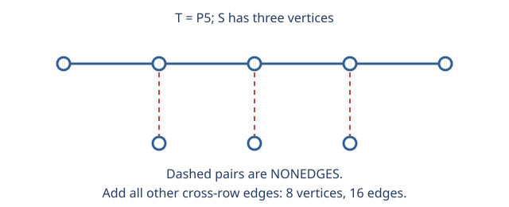

# 3. Missing-neighbor fibers

Let $T$ be a nonstar tree on $k+1$ vertices and $S$ an independent $(k-1)$-set. Partition $S$ into $S_t$ with $|S_t|=\deg_T(t)-1$. Join each $S_t$ to every tree vertex other than $t$. The identity

$$\sum_t(\deg_T(t)-1)=2k-(k+1)=k-1$$

makes the partition possible, and

$$\deg_G(t)=\deg_T(t)+k-1-|S_t|=k$$

makes the graph regular. A mixed independent set has at most $1+|S_t|=\deg_T(t)\le k-1$ vertices. A star would violate the required independence number.

Connectivity has two cases. With at least three surviving tree vertices, the surviving independent-set vertices share a connected component and at most one tree vertex could be outside it. Isolating that vertex costs at least $k$ deletions. With exactly two surviving tree vertices, all independent-set vertices survive; if no vertex joins both, those tree vertices are the two internal vertices of a double star, whose edge reconnects them.

Conversely, degree-sum equality forces regularity. Deleting any maximum independent set leaves a connected $(k+1)$-vertex graph with $k$ edges, hence a tree. The fiber sizes follow from regularity. See the [full proof](../experiments/EXP-001-tree-strip/proof.md) for every quantifier and case.

## Extension beyond the tree strip

The full shell uses a residual graph on $k+1$ vertices and an independent set of size $\alpha$. Its constructions split into complement cycles ($\alpha=2$), the crown graph ($\alpha=k+1$), a residual matching ($\alpha=k$), the preserved tree strip ($\alpha=k-1$), and Harary graphs with a matching added in their complements for the remaining cases. Missing-neighbor fibers adjust degrees so the final edge count reaches the degree-sum bound, including odd parity.

The [EXP-002 proof](../experiments/EXP-002-next-shell/proof.md) supplies the matching bound, cyclic-gap connectivity argument, exact independence number, and deletion cases. Its $\alpha=2$ classification follows by forcing a 2-regular complement: triangles violate independence and 4-cycles violate connectivity; cycles of length at least five suffice. General residual graphs replace trees, so the original tree characterization is retained only on its own strip.

## EXP-003: a degree deficit and a matching budget

For a triangle-free graph $F$ of order $n=2d+3$ and maximum degree at most $d$, define $D=nd-2e(F)$. If $F$ is nonbipartite, a shortest odd cycle $C$ has length at least five, and every outside vertex has at most two neighbors on it. Consequently the sum of the cycle-vertex degrees is at most $2n$, giving $D\ge d-6$. The only edge count above the target left by this bound is $d^2+d+3$.

At that equality, the cycle has length five and every outside vertex has degree $d$ and exactly two cycle neighbors. Five neighborhood types have sizes $n_i\ge1$, sum $2d+3$, and adjacent-type sums at most $d$, equal to $d$ whenever $n_i\ge2$. The [proof](../experiments/EXP-003-triangle-free-next-matching/proof.md) excludes these constraints for all $d>6$ by considering a singleton type and then adjacent singleton types. This proves the sharp fixed-order upper bound $d^2+d+2$.

Tutte-Berge then gives a vertex set $S$ such that $\nu(F)=|S|+\sum_C\lfloor|C|/2\rfloor$. Edges incident to $S$ cost at most $d|S|$. Degree and Mantel bounds control the components; only one component can have matching budget at least $d$, and the fixed-order theorem limits the total surplus to two. The result is $T(d,d+1)=d^2+d+2$. The known BET construction attains it.

For the Bougard-Joret bracket, complement a crown graph with one edge subdivided. A disconnected surviving complement would require a complete bipartite subgraph too large to occur in that construction. The raw BET extremizer instead has two false twins with $d$ common neighbors, producing a forbidden cut of size $d+1$. Its complement has connectivity exactly $d+1$, not the required $d+2$; this rejected shortcut is part of the proof record.
