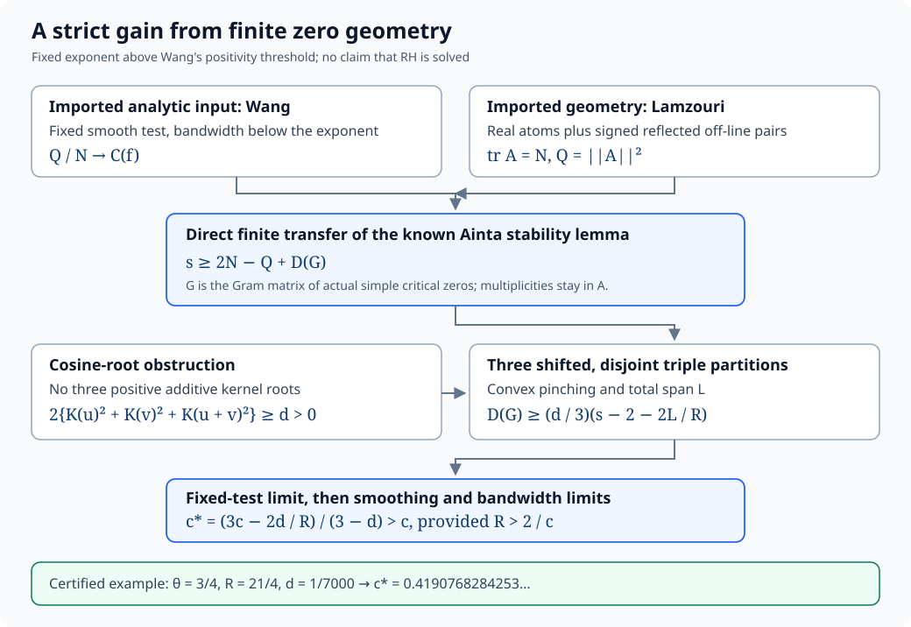

# Riemann hypothesis: zero proportions and short-interval stability

[D] The Riemann hypothesis remains open. This research unit derives a strict
improvement to Wang's asymptotic lower proportions of simple critical zeros
and distinct zeros in $(T,T+T^\theta]$, for every fixed $\theta_0<\theta<1$
as $T\to\infty$. Here
$\theta_0$ is the unique zero of

$$c(\theta)=2-\frac\theta2-\frac1{\sqrt2}\cot(\theta/\sqrt2),
\qquad \theta_0=0.550193964744154\ldots.$$

The improvement retains the known simple-zero Gram defect in Lamzouri's exact
finite Hilbert operator. A three-point energy bound makes that defect occupy a
positive proportion of the interval. The finite stability lemma and the
cosine-root obstruction are attributed to earlier work; the candidate new
contribution is their direct short-interval application and its quantitative
certificate. See the [confirmed EXP-002 verdict](../experiments/EXP-002-short-interval-stability/verdict.md)
and [independent adversarial audit](../experiments/EXP-002-short-interval-stability/adversarial-audit.md).

[D+MV] At $\theta=3/4$, the certified choice $R=21/4$, $d=1/7000$ gives

$$c_*=0.4190768284253039967366657875\ldots,
\qquad \frac{1+c_*}{2}=0.7095384142126519983\ldots.$$

The simple-critical baseline is $0.4190750129754243337345536107\ldots$.
The gain is approximately $1.81545\times10^{-6}$ in proportion, or
$0.000181545$ percentage points. This is a short-interval refinement, not a
global record above the recent $67.25\%$ theorem or subsequent global
candidates. It supplies neither an improved positivity exponent nor a
practical starting height. The [certificate and exact result](../experiments/EXP-002-short-interval-stability/artifacts/result.json)
determine the displayed numerical values.

1. [Statement, counting conventions, and history](01-statement.md)
2. [Known results, optimization barriers, and formal scope](02-known-results.md)
3. [Full finite-operator and short-interval proof](03-mechanism.md)
4. [Experiments, certificates, and reproduction](04-experiments.md)
5. [Open questions and rejected approaches](05-open-questions.md)

The [problem bibliography](../references.md) distinguishes primary theorems,
research candidates, inspected formal sources, and process evidence. Source
URLs, versions, byte hashes, and license metadata are in the
[source manifest](../context/source-manifest.json). The raw cache can be restored
from that manifest; the public record does not relicense third-party PDFs.

The preprint [A stability refinement for simple critical zeros in short intervals](https://zenodo.org/records/22727389)
is published as version 0.01 with version DOI
[10.5281/zenodo.22727389](https://doi.org/10.5281/zenodo.22727389) and concept DOI
[10.5281/zenodo.22727388](https://doi.org/10.5281/zenodo.22727388).
The [publication receipt](../../../../manuscripts/riemann-hypothesis/short-interval-stability/publication-receipt.json)
records fresh public metadata and PDF-download verification. The 10-page,
368,644-byte PDF has SHA-256
`f38d47b6daebc3fa2277542e009ce2cd5625e5daeb05bda57df726a46cc48761`.
The [manuscript source](../../../../manuscripts/riemann-hypothesis/short-interval-stability/main.tex)
preserves the proof and attribution. The preprint is not peer reviewed;
publication and the current novelty search do not establish community
acceptance or priority against undiscovered work.

Evidence labels used here: **[D]** denotes a derived mathematical claim with a
persisted proof and refutation attempt; **[MV]** denotes a machine-verified
finite assertion; **[C]** denotes a conjectural direction. Imported results
are identified by their primary sources rather than relabeled as CAOS results.
