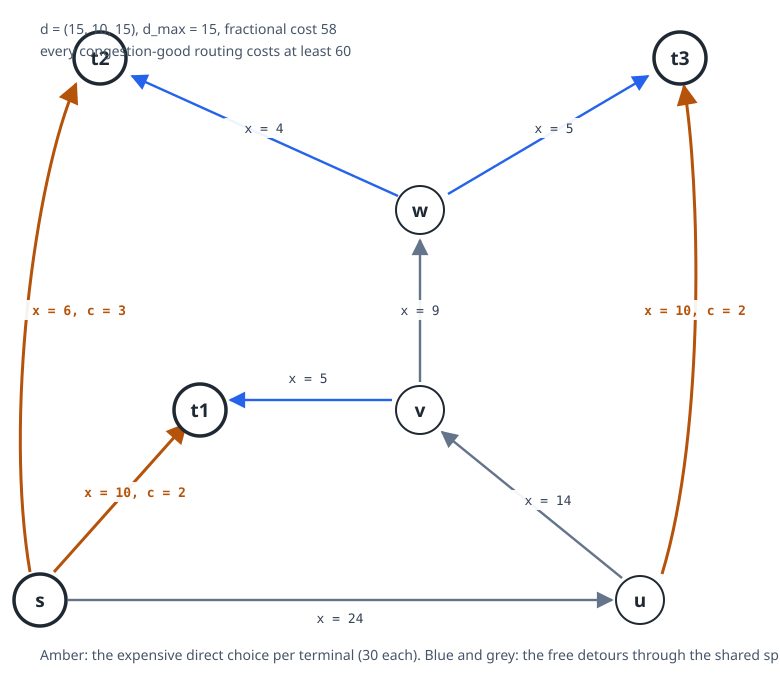

# 03 - The mechanism: why the counterexample works

Transcribed from the EXP-002 verdict and the counterexample dossier. Every number here was
computed by `ufclib` in exact rational arithmetic and is reproducible by rerunning
`experiments/EXP-002-adjudicate-2026-claim/run.py`.

## The instance

Vertices $s, u, v, w, t_1, t_2, t_3$; demands $d = (15, 10, 15)$, so $d_{\max} = 15$; nine
arcs with fractional loads and per-unit costs:

| arc | $x_a$ | $c_a$ | bound $x_a + d_{\max}$ |
|---|---|---|---|
| $s \to t_1$ | 10 | 2 | 25 |
| $s \to t_2$ | 6 | 3 | 21 |
| $s \to u$ | 24 | 0 | 39 |
| $u \to t_3$ | 10 | 2 | 25 |
| $u \to v$ | 14 | 0 | 29 |
| $v \to t_1$ | 5 | 0 | 20 |
| $v \to w$ | 9 | 0 | 24 |
| $w \to t_2$ | 4 | 0 | 19 |
| $w \to t_3$ | 5 | 0 | 20 |

$x$ is a feasible fractional flow (conservation verified at all seven vertices) with
$c^T x = 2 \cdot 10 + 3 \cdot 6 + 2 \cdot 10 = 58$. [MV]

## Two choices per terminal, and only two

Our own path search finds exactly two simple $s$-$t_i$ paths per terminal, hence exactly
eight routings. [MV; this is the check that kills most candidate counterexamples, so it is
never taken on trust]

$$E_1 = s\,t_1, \quad Z_1 = s\,u\,v\,t_1; \qquad E_2 = s\,t_2, \quad Z_2 = s\,u\,v\,w\,t_2; \qquad E_3 = s\,u\,t_3, \quad Z_3 = s\,u\,v\,w\,t_3 .$$

Each expensive choice costs exactly 30 when it carries its demand
($15 \cdot 2 = 10 \cdot 3 = 15 \cdot 2 = 30$); each free choice costs 0. The design is
deliberately symmetric in price so that the count of expensive choices alone determines the
cost.

## The conflict triangle

The three free choices are PAIRWISE incompatible with the congestion bound. [MV, and
derived independently of the cost enumeration]

- $Z_1$ with $Z_3$: arc $u \to v$ carries $15 + 15 = 30 > 29$.
- $Z_2$ with $Z_3$: arc $v \to w$ carries $10 + 15 = 25 > 24$.
- $Z_1$ with $Z_2$: arc $s \to u$ carries $15 + 10 + 15 = 40 > 39$, because $t_3$ enters
  through $s \to u$ on EITHER of its paths. This third conflict is the subtle one: it does
  not come from the two chosen detours alone, but from their interaction with an unavoidable
  arc.

So the conflict graph on $\{Z_1, Z_2, Z_3\}$ is a TRIANGLE, its independence number is 1,
and every congestion-good routing uses at least two expensive choices, costing at least
$30 + 30 = 60 > 58$. That is the whole proof, and it needs no enumeration of the eight
routings. [MV: the structural route and the enumeration agree on 60]

## The complete routing table

| $t_1$ | $t_2$ | $t_3$ | cost | $\alpha$ | status | violated arcs |
|---|---|---|---|---|---|---|
| $E_1$ | $E_2$ | $E_3$ | 90 | 1/3 | congestion-good | - |
| $E_1$ | $E_2$ | $Z_3$ | 60 | 2/3 | congestion-good | - |
| $E_1$ | $Z_2$ | $E_3$ | 60 | 2/5 | congestion-good | - |
| $E_1$ | $Z_2$ | $Z_3$ | 30 | 16/15 | cost-good only | $v \to w$ by 1 |
| $Z_1$ | $E_2$ | $E_3$ | 60 | 2/3 | congestion-good | - |
| $Z_1$ | $E_2$ | $Z_3$ | 30 | 16/15 | cost-good only | $u \to v$ by 1 |
| $Z_1$ | $Z_2$ | $E_3$ | 30 | 16/15 | cost-good only | $s \to u$ by 1 |
| $Z_1$ | $Z_2$ | $Z_3$ | 0 | 26/15 | cost-good only | $s \to u$ by 1, $u \to v$ by 11, $v \to w$ by 1 |

Here $\alpha$ is the smallest budget, in units of $d_{\max}$, at which that routing becomes
congestion-good. The two statuses never coincide: the conjecture fails. [MV]

## The invariant: a stable-set gap in disguise

The mechanism is not flow-theoretic. Read the free choices as nodes of a conflict graph
$H$, let $\rho_i$ be the fraction of terminal $i$'s demand that the FRACTIONAL flow sends on
its free choice:

$$\rho = \left(\frac{x_{v \to t_1}}{d_1}, \frac{x_{w \to t_2}}{d_2}, \frac{x_{w \to t_3}}{d_3}\right) = \left(\frac{5}{15}, \frac{4}{10}, \frac{5}{15}\right) = \left(\frac13, \frac25, \frac13\right), \qquad \sum_i \rho_i = \frac{16}{15} > 1 .$$

A congestion-good integral routing selects an INDEPENDENT SET of $H$, so it buys at most 1
unit of free routing; the fractional flow buys $16/15$. The instance is exactly the
LP-integrality gap of the stable-set polytope on a triangle, transported into flow
language, and the arc costs are a nonnegative separator of the violated triangle
inequality $\rho_1 + \rho_2 + \rho_3 \le 1$. [MV for the numbers; [D] for the reading]

Two consequences of this reading:

1. **Three terminals are necessary.** A conflict graph on at most two nodes has no odd
   cycle, so its stable-set polytope is integral and no such separation exists. [D, the base
   rung of the minimality ladder, backlog UFB-025]
2. **Where to look for stronger counterexamples**: longer odd cycles of conflicts, whose
   fractional stable-set value reaches $k/2$, and conflict cliques, which reach $k$. Whether
   flow structure can realise those gaps under the $d_{\max}$ budget is the open
   quantitative question. [C, backlog UFB-020, UFB-021]

## How much is actually forced

$\alpha_{\mathrm{inst}} = 16/15$ exactly: the cheapest budget at which some cost-good
routing becomes admissible. In absolute units, a cost-preserving rounding needs 16 units of
slack on one arc where the conjecture allows 15. [MV]

**The conjecture is refuted by one unit.** That is the honest headline. The instance shows
the constant 1 is unattainable; it leaves untouched the question of whether some constant
works, where the only known upper bound is 2 for planar graphs.

An open question minted by this run: $\sum_i \rho_i$ and $\alpha_{\mathrm{inst}}$ are both
$16/15$ here. Whether that equality is structural or a coincidence of this instance's
calibration is unresolved. [C, backlog UFB-032]

## Where the instance sits in the class landscape

- The underlying undirected graph contains a $K_4$ SUBDIVISION with branch vertices
  $\{s, u, v, w\}$, verified by an internally-disjoint-paths search. Series-parallel
  digraphs are $K_4$-minor-free, so the instance lies just outside the class where the
  conjecture is proved. [MV]
- It is PLANAR: no vertex has degree 4 or more and only four have degree 3, so neither a
  $K_5$ nor a $K_{3,3}$ subdivision can exist and Kuratowski gives planarity with no
  embedding computation. [MV]
- It is ACYCLIC, which is what makes the refutation propagate to the Morell-Skutella cost
  conjecture. [MV]
- Its demands $\{15, 10\}$ are not multiples of one another, as Skutella's proved case
  requires them not to be. [MV]

The picture: the conjecture holds on the series-parallel side of the $K_4$ boundary and
fails at the first structure past it; and for planar graphs the true constant is pinched
strictly between 1 and 2.
